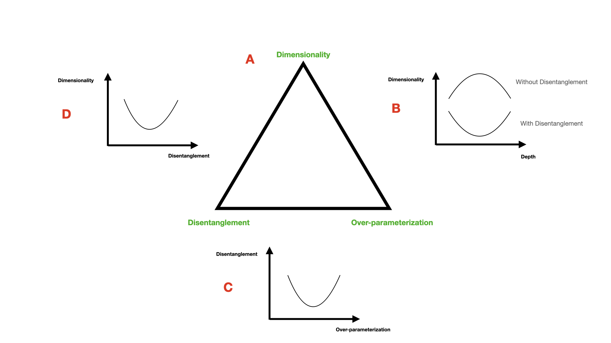

# Neuro-Inspired Vision

## Trade-off among Over-parameterization, Disentanglement, and Dimensionality in Neural Networks

### Question
The aim of this project is to investigate the following question: how three different characteristics of neural networks - number of parameters, disentanglement of intermediate representations, and dimensionality of intermediate representations - interact with each other. The tool I used to this end is a collection of computational experiments with shallow and deep feed-forward neural networks on low-dimensional but factorized linear and nonlinear data.

### Background 
One clear sign of human intelligence is its remarkable capacity to learn quickly from a few samples and to generalize well to unseen tasks. It is generally believed that this is due to human ability to form abstract and disentangled representations of concepts from the stream of environmental stimuli. However, the substrate of human intelligence, brain, is an over-parameterized model which naturally must over-fit to training data and particularly not generalize well to out-of-distribution data. To solve this puzzle, scientists use neural networks to model brain. By interrogating these models via their different properties such as architectures, objective functions, and learning rules (Richards et al. (2019)), it is possible to test which inductive biases generate neural networks with better in-distribution or out-of-distribution generalization. The performance of neural networks is generally characterized by a double-descent curve. A double-descent curve indicates that in over-parameterized regime - in contrast to popular view that neural networks must over-fit on training data, thus not to be able to generalize well on unseen data - the in-distribution generalization error decreases (Belkin et al. (2019)). It is possible to justify this phenomena by implicit inductive bias of gradient descent, meaning that in over-parameterized regime, deep models find less complex solutions which generalize well on unseen in-distribution test data (Poggio et al. (2020)). On the other hand, there is another phenomenon: an inductive bias of stochastic gradient descent in over-parameterized generative models tends to find solutions which are entangled, thus not having a good out-of-distribution generalization (Besserve et al. (2020)). Putting together these two phenomena, the immediate hypothesis coming to mind is that probably there is a trade-off between over-parameterization and disentanglement in neural networks. Moreover, recently, it has been shown that disentangled solution could be induced in a neural network by imposing the following two biological constraints: non-negativity of activities, and energy efficiency in both activities and weights (Whittington et al. (2022)). Simultaneously, disentanglement can be quantified by a measure called mutual information ratio (MIR) (Whittington et al. (2022)). Applying these criteria and measure to an arbitrary neural network but a structured data is straightforward. Additionally, by introducing a new technique, recently, it has been shown that the dimensionality of manifolds across deep hierarchy in deep neural networks and the primate visual pathway do not match to each other (Sorscher et al. (2022)): in primate visual hierarchy the dimensionality of stimuli first decreases and then increases, while in deep neural networks the dimensionality of stimuli first increases and then decreases. Here, I hypothesized that by imposing the biological constraints mentioned above on deep models to force them to generate disentangled representations, the trend of dimensionality in deep models corresponds to the trend of dimensionality across primate visual hierarchy. Finally, it is believed that entangled representation or mixed selectivity in brain helps sample efficient learning or reconstruction of stimuli by a linear readout from the visual hierarchy. I test this hypothesis by using a recently introduced technique to reconstruct the stimuli from various layers of deep models (Bordelon and Pehlevan (2022)).

### Figure
The below figure is provided as a guideline for various hypotheses. Panel (A) depicts the trade-off relation among over-parameterization, disentanglement, and dimensionality. In panels (B-D), I bring schematic representations of three possible hypotheses tested in this project. In panel (B), I hypothesized that the reason that the trend of dimensionality of the manifolds across deep hierarchy of deep neural networks is different compared to the same geometry in the primate visual pathway is because of inherent disentanglement in the brain via its cell types which can be tested by imposing the same biological constraints on deep models. In panel (C), it is hypothesized that by increasing over-parameterization, the disentanglement first decreases and then increases in neural networks. Finally, in panel (D), it is hypothesized that dimensionality first decreases and then increases by increasing the disentanglement in a neural network.

  

## Results
To perform the computational experiments, the following codes have been used:
- For the experiments to impose biological constraints and measure disentanglement, I used the source code of the paper (Whittington et al. (2022)).
- For the experiments to measure the geometry or dimensionality across deep networks, I used the [source code](https://github.com/bsorsch/geometry-fewshot-learning) of the paper (Sorscher et al. (2022)) (Method 1) and the [source code](https://github.com/ansuini/IntrinsicDimDeep) of the paper (Facco et al. (2017)) (Method 2).
- For the experiments to reconstruct the input stimuli from the intermediate representation of deep neural networks, I used the [source code](https://github.com/Pehlevan-Group/sample_efficient_pop_codes) of the paper (Bordelon and Pehlevan (2022)).

The two provided notebooks are all you need to run the experiments and plot the results after installing the required python modules. In the first notebook, the training is performed and the cumulative plots of the computation of the geometry and sample efficient reconstruction of the stimuli are provided. Moreover, another quick hypothesis regarding the change of the absolute weights versus the number of parameters in deep neural networks has been tested. In the second notebook, an extensive experiment with the number of parameters ("Hidden Mult" refers to the multiplication factor of the number of parameters per layer in the neural networks) in neural networks and their measured disentanglement has been provided.

I argue that I could partially confirm the above mentioned hypotheses. For example, referring to the panel (B) of the above figure, I could show that when we impose biological constraints on the neural networks to force them to have disentangled representations, the trend of dimensionality across deep hierarchy matches to what we observe in the primate visual hierarchy (For example, refer to sections 2.3.6 and 2.4.6 in the first notebook), and this is more pronounced with the first method compared to the second method of computing geometry (In the first notebook, compare the figure in section 2.3.6 with the one in section 2.3.9, and the figure in section 2.4.6 with the one in section 2.4.9). Now consider the panel (C) of the above figure with scarce evidence for its validity (For example, refer to the section 2.1.1.6 of the second notebook). Most cumulative plots in the second notebook show some zigzag patterns of the variation of the disentanglement versus the number of parameters in deep models (For example, refer to the cumulative plots of the sections 2.1.3, 2.1.4, 2.1.5, and 2.1.6 in the second notebook). One limitation of the current study is that for each set of parameters only one simulation has been run. However, I argue that the results are robust, meaning that the standard deviation resulted from further simulations will not be that much to change the trend of the curves (For example, again refer to the section 2.1.1.6 in the second notebook in which each set of points with the same color refers to 5 different simulations with slightly different beta values). Based on this discussion, I believe, overall, we could say that there is an interdependence between the number of parameters of neural networks and their disentanglement capacity, but this relation is not straightforward. To further characterize this relation, there is a need for analytical and mathematical treatment of the problem. Referring to the panel (D) of the above figure, via the discussion mentioned earlier for panel (B), we could say that since in deep neural networks the higher layers are more disentangled compared to lower layers, and also the shape of dimensionality across layers - after imposing biological constraints - is an inverse hump-shape, thus the relation between dimensionality and disentanglement is also similar to an inverse hump-shape. Furthermore, regarding the reconstruction of stimuli from their representations across deep layers, I could show that the reconstruction from the lower layers with less disentanglement or more mixed selectivity is more sample efficient compared to the reconstruction from the higher layers with more disentanglement or less mixed selectivity (For example, refer to sections 2.1.12, 2.2.12, 2.3.12, and 2.4.12 of the first notebook). Finally, the absolute weights of the neural networks with disentanglement versus the number of parameters is more flat compared to the absolute weights of the neural networks without disentanglement. This is also not surprising since one of the biological constraints regularizes the weight energy in neural networks.

## References
- Belkin, M., Hsu, D., Ma, S., and Mandal, S. (2019). Reconciling modern machine-learning practice and the classical bias-variance trade-off. PNAS.
- Besserve, M., Sun, R., Janzing, D., and Schölkopf, B. (2020). A theory of independent mechanisms for extrapolation in generative models. ArXiv.
- Bordelon, B. and Pehlevan, C. (2022). Population codes enable learning from few examples by shaping inductive bias. eLife.
- Facco, E., d'Errico, M., Rodriguez, A., and Laio, A. (2017). Estimating the intrinsic dimension of datasets by a minimal neighborhood information. Scientific Reports.
- Poggio, T., Banburski, A., and Liao, Q. (2020). Theoretical issues in deep networks. PNAS.
- Richards, B. A., Lillicrap, T. P., Beaudoin, P., Bengio, Y., Bogacz, R., Christensen, A., Clopath, C., Costa, R. P., de Berker, A., Ganguli, S., Gillon, C. J., Hafner, D.,    Kepecs, A., Kriegeskorte, N., Latham, P., Lindsay, G. W., Miller, K. D., Naud, R., Pack, C. C., Poirazi, P., Roelfsema, P., Sacramento, J., Saxe, A., Scellier, B., Schapiro, A. C., Senn, W., Wayne, G., Yamins, D., Zenke, F., Therien, J. Z. D., and Kording, K. P. (2019). A deep learning framework for neuroscience. Natue Neuroscience.
- Sorscher, B., Ganguli, S., and Sompolinsky, H. (2022). Neural representational geometry underlies few-shot concept learning. PNAS.
- Whittington, J. C., Dorrell, W., Ganguli, S., and Behrens, T. E. (2022). Disentangling with biological constraints: A theory of functional cell types. ArXiv.
